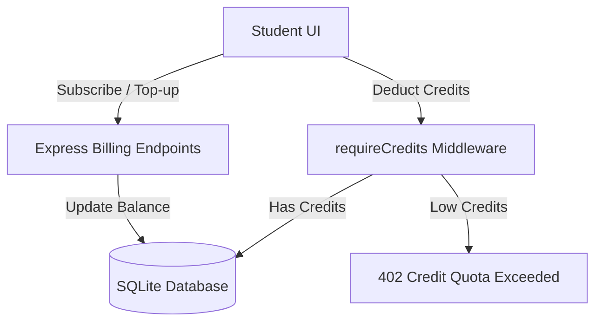

# Astra Hybrid Billing Model - Implementation Plan (Phase 3)

This plan details the integration of a **Hybrid Subscription & Token Credit system** for Astra:
*   **Free Tier**: Users start with **5 complimentary credits** upon registration.
*   **Premium Subscription**: Users pay a flat rate (mocked for now) which upgrades their tier to `PREMIUM` and grants them **100 recurring monthly credits**.
*   **One-Off Top-Ups**: Users can purchase token packs (e.g. 50 credits) if they run out of credits, regardless of their subscription status.
*   **Deduction Matrix**:
    *   AI Suggestion Query: `1.0` credit
    *   Dynamic Milestone Generation: `1.0` credit
    *   Advisor Chat: `0.1` credit per message
    *   University Alignment Evaluation: `2.0` credits

---

## 🛠️ Proposed Architecture & Code Changes



### 1. Database Schema Updates (`schema.prisma`)
Modify the `User` model to track subscription tiers and credit balances:

```prisma
model User {
  id                    String        @id @default(uuid())
  email                 String        @unique
  name                  String?
  tier                  String        @default("FREE") // FREE, PREMIUM
  credits               Float         @default(5.0)    // Token balance
  stripeSubscriptionId  String?       // Reference for billing
  createdAt             DateTime      @default(now())
  profile               Profile?
  profileDraft          ProfileDraft?
  userProjects          UserProject[]
}
```

### 2. Credit Deduction Middleware (`backend/index.js`)
We will write a `requireCredits(cost)` middleware function that intercepts API requests:
*   Checks if `user.credits >= cost`.
*   If true, deducts `cost` from `user.credits` and proceeds.
*   If false, throws a `402` status: `"Insufficient credits. Please upgrade your plan or purchase top-ups."`

### 3. Backend Billing Endpoints (`backend/index.js`)
*   **`GET /api/billing/info`**: Returns current tier, credits, and pricing options.
*   **`POST /api/billing/subscribe`**: Simulates/processes upgrading to the Premium tier (sets tier to `PREMIUM` and adds `100` credits).
*   **`POST /api/billing/buy-credits`**: Simulates purchasing credits (adds `amount` credits to balance).

### 4. Frontend UI Upgrades (`frontend/src/App.jsx`)
*   **Credit Badge**: Add a visual badge in the header displaying the student's current tier and credit balance (e.g. `🪙 4.5 Credits`).
*   **Billing Dashboard Tab**: Add a "Billing & Account" view showing:
    *   Plan selection (Free vs Premium subscription).
    *   Token purchase buttons ("Buy 50 Tokens for $5").
    *   A simple, visually appealing transaction invoice receipt log.
*   **Error Modal**: Add a customized modal if a 402 error is returned, directing the student to the Billing page to top-up.

---

## Open Review Required

> [!IMPORTANT]
> - Should we rollover unused subscription credits monthly, or should subscription-granted credits expire at the end of each billing cycle? We propose **rolling them over** to maximize student satisfaction.
> - For production transition: We will write the billing logic to easily plug in live Stripe checkout links once you input a Stripe Publishable Key.

---

## Verification Plan

### Automated Tests
- Integration tests checking that `/api/projects/suggestions` (cost: 1.0) deducts exactly 1.0 from the user's database entry.
- Quota test verifying that a user with `0.05` credits receives a 402 error when attempting to chat (cost: 0.1).

### Manual Verification
- Log in to the app, verify Free tier starts with 5 credits.
- Purchase credits in Billing dashboard, verify balance increases.
- Trigger recommendations, milestone builds, and chat messages, checking that the credit indicator in the header decrements in real-time.
