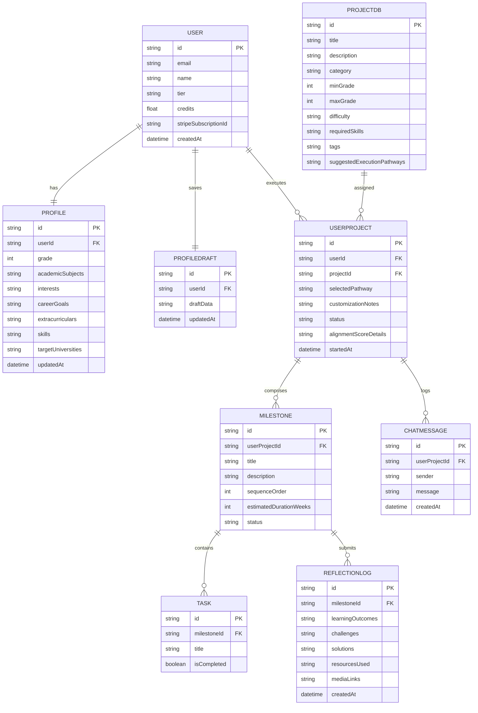
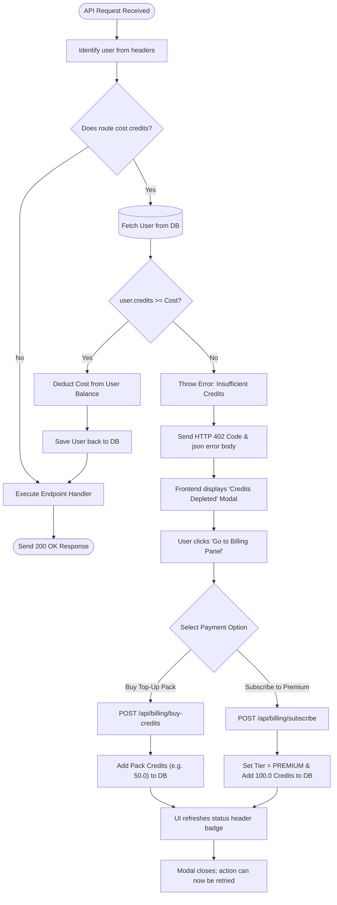

# Astra Admission Advisor - Technical Flow Documentation

This document provides a comprehensive technical overview of Astra, including its system architecture, database models, user journey flowcharts, and the transactional logic of the hybrid subscription and token billing system.

---

## 🏗️ System Architecture

Astra is built using a modern decoupled architecture:

```mermaid
graph LR
    subgraph Frontend [React SPA (Vite)]
        UI["User Interface"]
        State["React State / LocalStorage"]
    end

    subgraph Backend [Express.js Server]
        API["Express Router"]
        Auth["Mock OAuth Middleware"]
        Billing["Billing Controller"]
        Deduct["Credit Verification Middleware"]
        GeminiService["Gemini API Integration"]
    end

    subgraph Storage [Database]
        Prisma["Prisma Client v6"]
        DB[("SQLite File dev.db")]
    end

    subgraph External [AI Core]
        Gemini["Google Gemini 2.5 Flash API"]
    end

    UI --- API
    API --- Auth
    API --- Billing
    API --- Deduct
    Deduct --- Prisma
    Billing --- Prisma
    GeminiService --- Gemini
    API --- GeminiService
    Prisma --- DB
```

*   **Frontend**: Built with React (Vite). Styling is done using custom vanilla CSS for glassmorphism and reactive layouts. State is persisted locally via `localStorage` for seamless resumption.
*   **Backend**: An Express.js server running in ES Modules mode. Enforces security and rate-limiting using `express-rate-limit`.
*   **Database ORM**: Prisma 6 mapping schemas to a local SQLite database (`dev.db`).
*   **AI Engine**: Integrates `@google/genai` to utilize `gemini-2.5-flash` with custom JSON response schemas.

---

## 🗄️ Database Schema & Relationships

The database is structured to track profile drafts, active milestones, and student reflections:



---

## 🔄 Core User Flow Lifecycle

The diagram below outlines a student's journey from landing on the platform to obtaining their final admissions portfolio.

```mermaid
sequenceDiagram
    autonumber
    actor Student as Student (UI)
    participant Server as Express Server
    participant DB as SQLite DB (Prisma)
    participant LLM as Google Gemini API

    Note over Student, Server: 1. Registration & Resume Draft Setup
    Student->>Server: Login (OAuth Gmail payload)
    Server->>DB: Upsert User (creates FREE profile, sets credits = 5.0)
    DB-->>Server: Return User & Draft status
    Server-->>Student: Set user in state; notify if draft exists

    Note over Student, Server: 2. Interactive Wizard Auto-Saving
    loop Every 2 seconds on form input change
        Student->>Server: POST /api/profile/draft (payload)
        Server->>DB: Upsert ProfileDraft
        DB-->>Student: Auto-save Ack
    end
    Student->>Server: POST /api/profile (Submit final)
    Server->>DB: Create Profile, Delete ProfileDraft
    Server-->>Student: Profile saved successfully

    Note over Student, LLM: 3. AI Suggestions (Cost: 1.0 token)
    Student->>Server: GET /api/projects/suggestions
    Server->>DB: Check & deduct 1.0 credits
    Server->>LLM: Evaluate profile compatibility + rank library
    LLM-->>Server: Ranked JSON array + reasoning
    Server-->>Student: Display suggested projects

    Note over Student, LLM: 4. Pathway Customization & Milestone Generation (Cost: 1.0 token)
    Student->>Server: POST /api/projects/select (ID + Pathway)
    Server->>DB: Check & deduct 1.0 credits; Archive old projects
    Server->>LLM: Generate milestones + tasks + resources
    LLM-->>Server: structured milestone JSON roadmap
    Server->>DB: Create UserProject, Milestones, and Tasks
    Server-->>Student: Show active project dashboard

    Note over Student, LLM: 5. Chat & Reflections (Cost: 0.1 tokens/chat message)
    Student->>Server: POST /api/projects/active/chat (message)
    Server->>DB: Check & deduct 0.1 credits; Save user message
    Server->>LLM: Request Astra reply based on profile + 15 msg history
    LLM-->>Server: Advisor response text
    Server->>DB: Save advisor message
    Server-->>Student: Display message in sidebar chat

    Note over Student, LLM: 6. Completion & Alignment scoring (Cost: 2.0 tokens)
    Student->>Server: POST /api/projects/active/complete
    Server->>DB: Check & deduct 2.0 credits
    Server->>LLM: Generate Match Score % & Common App bullet tips
    LLM-->>Server: structured alignment scoring JSON
    Server->>DB: Set status = COMPLETED, save alignment details
    Server-->>Student: Show printable Final Portfolio Report
```

---

## 🪙 Billing Transaction Flow & Error Handling

To protect LLM service limits, the backend implements a transaction check for all credit deductions:



### Route Cost Matrix

| API Endpoint | Description | Cost |
| :--- | :--- | :--- |
| `GET /api/projects/suggestions` | Generates personalized ranked ideas. | **1.0 token** |
| `POST /api/projects/select` | Generates milestones, roadmaps, and custom tasks. | **1.0 token** |
| `POST /api/projects/active/chat` | AI advisor chatbot interaction. | **0.1 tokens** |
| `POST /api/projects/active/complete` | Generates target university alignment & scorecard. | **2.0 tokens** |
| All other routes (e.g. login, drafts, logs, tasks) | Core app operations and state changes. | **Free (0.0)** |

### 402 HTTP Response Structure
When a user lacks enough credits, the server returns a `402` payload:
```json
{
  "error": "Insufficient credits. Requires 1.0 credit(s), but you only have 0.40.",
  "currentCredits": 0.4,
  "requiredCredits": 1.0
}
```
The React frontend catches this exception, displays a custom modal using the returned JSON attributes, and redirects the student to the **Billing Dashboard** to upgrade or buy credit packs.
